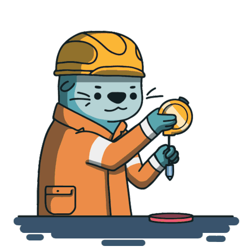
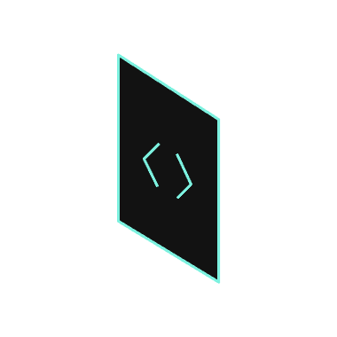
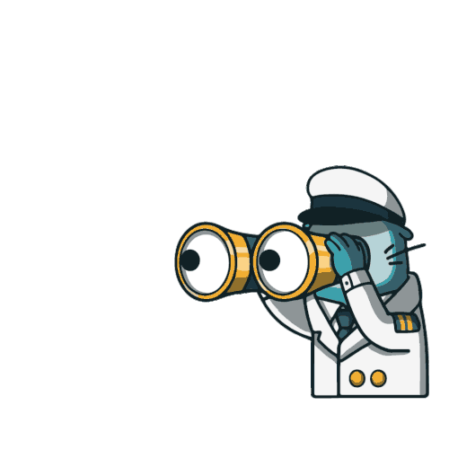

<p align="center">
   <a href="https://github.com/Arquisoft/lomap_es3a/actions/workflows/lomap_es3a.yml">
      
   </a>
   <a href="https://sonarcloud.io/summary/new_code?id=Arquisoft_lomap_es3a">
      
   </a>
   <a href="https://sonarcloud.io/summary/new_code?id=Arquisoft_lomap_es3a">
      
   </a>
</p>

<h1 align="center"></h1>

<p align="center">
   <a href="https://arquisoft.github.io/lomap_es3a/">
      Documentación
   </a>
   ·
   <a href="https://github.com/Arquisoft/lomap_es3a/discussions">
      Discusiones
   </a>
   ·
   <a href="https://github.com/Arquisoft/lomap_es3a/wiki">
      Wiki
   </a>
   ·
   <a href="https://github.com/Arquisoft/lomap_es3a/issues/new?assignees=&labels=&template=bug_report.md&title=">
      Reportar un bug
   </a>
   ·
   <a href="https://github.com/Arquisoft/lomap_es3a/issues/new?assignees=&labels=&template=feature_request.md&title=">
      Solicitar una funcionalidad
   </a>
   ·
   <a href="https://github.com/Arquisoft/lomap_es3a/projects?query=is%3Aopen">
      Proyectos
   </a>
</p>

<details>
  <summary>Tabla de contenidos</summary>
  <ol>
    <li>
      <a href="#🖥️-desarrolladores-del-proyecto">
         Desarrolladores del proyecto.
      </a>
    </li>
    <li>
      <a href="#🗺️-descripción-del-proyecto">
         Descripción del proyecto.
      </a>
      <ol>
         <li>
            <a href="#🛠-pila-de-tecnologías">
               Pila de tecnologías.
            </a>
      </ol>
    </li>
    <li>
      <a href="#📑-instrucciones-de-despliegue">
         Instrucciones de despliegue.
      </a>
    </li>
  </ol>
</details>

## 🖥️ Desarrolladores del proyecto:


|       Desarrolladores        |        UOs         |                                                       Perfiles de GitHub                                                       |
|:----------------------------:|:------------------:|:------------------------------------------------------------------------------------------------------------------------------:|
|    Carlos Diez Fernández     | UO284373@uniovi.es |  <a href="https://github.com/uo284373"></a>  |
|    Raúl Fernández España     | UO278036@uniovi.es |   <a href="https://github.com/UO278036"></a>   |
|    Omar Teixeira González    | UO281847@uniovi.es |    <a href="https://github.com/Omitg24"></a>     |
| David Leszek Warzynski Abril | UO278968@uniovi.es | <a href="https://github.com/UO278968"></a> |


## 🗺️ Descripción del proyecto:

<p align="justify">
Este proyecto se ha realizado en conjunto entre los desarrolladores anteriormente mencionados como trabajo puesto por los profesores <em>Jose Emilio Labra Gayo</em>, <em>Pablo González</em>, <em>Irene Cid Rico</em> y <em>Cristian Augusto Alonso</em> para la asignatura de <strong>Arquitectura del Software</strong> (ASW) de la Universidad de Oviedo. 
</p>
<p align="justify">
En GOMap!® los usuarios podrán iniciar sesión y desde ahí interactuar con el mundo que les rodea, de esta forma, un usuario cualquiera podría ver marcadores, los cuales también pueden ser creados por otros usuarios, sobre los lugares que se encuentran en la ubicación buscada, estos lugares pueden ir desde tiendas a bares, restaurantes, paisajes, monumentos, etc...
</p>
<p align="justify">
A estos marcadores se les podrá añadir diferentes características, como imágenes o descripción sobre el mismo, pero no acaba ahí, ya que la verdadera interacción se produce en el momento en el que se pueden añadir reviews/opiniones sobre un marcador creado por otro usuario.
</p>

### 🛠 Pila de tecnologías:
<p align="justify">
La lista completa de las tecnologías empleadas, junto con sus decisiones arquitectónicas (ADR), se encuentra en el siguiente <a href="https://github.com/Arquisoft/lomap_es3a/wiki/Decisiones-Arquitectonicas">enlace</a>.
</p>

<ul>
   <li><a href="https://legacy.reactjs.org/">React</a>.</li>
   <li><a href="https://nodejs.org/en">NodeJS</a>.</li>
   <li><a href="https://www.typescriptlang.org/">TypeScript</a>.</li>
   <li><a href="https://solidproject.org/">SOLID</a>.</li>
   <li><a href="https://www.mongodb.com/">MongoDB</a>.</li>
   <li><a href="https://www.openstreetmap.org/">OpenStreetMap</a>.</li>
</ul>

## 📑 Instrucciones de despliegue:

<p align="justify">
   En primer lugar, se debe instalar Node (puede hacerse a través del enlace en la <a href="🛠-pila-de-tecnologías">pila de tecnologías</a>). En caso de que ya esté instalado, debe asegurarse que se tiene la última versión del mismo.
</p>
<p align="justify">
   Para ejecutar el proyecto, será necesario clonarlo primero, por lo que es necesario tener git (accede a través del siguiente <a href="https://git-scm.com/downloads">enlace</a>), y posteriormente, clonar este respositorio en un directorio local, ya sea descargándo el repositoio en formato <em>.zip</em> o de la siguiente manera:
</p>

<ol>
   <li>Dirigirse al directorio local donde clonar el repositorio.</li>
   <li>Abrir la consola o símbolo del sistema.</li>
   <li>Escribir el siguiente código:</li>
</ol>

```shell
   git clone https://github.com/Arquisoft/lomap_es3a.git
```
<p align="justify">
   Una vez hecho esto, puede lanzarse de dos maneras, usando docker, o lanzando la aplicación en 2 partes.
</p>
<p align="justify">
   En caso de que se decida emplear docker, se debe situar en la raiz del directorio del proyecto y ejecutar la siguiente orden mediante consola:
</p>

```shell
docker-compose up --build
```

<p align="justify">
   Esto creará dos imágenes docker en tu sistema y lanzará la base de datos de MongoDB, también se lanzarán varias métricas donde se registrará el uso de la aplicación, sin embargo, para acceder a la aplicación, basta con ir al siguiente <a href="http://localhost:3000">enlace</a>.
</p>

<p align="justify">
   En caso de que se quiera lanzar sin emplear docker, se debe compilar el proyecto y posteriormente, a través de la raíz del directorio, ejecutar las siguientes órdenes en consola:
</p>

```shell
# Lanzar la restapi
cd restapi
npm install
npm start

cd ..

# Lanzar la webapp
cd webapp
npm install
npm start
```

<footer>
   <p>
        <a href="https://arquisoft.github.io/">©Arquisoft - UNIOVI</a> 
   </p>
  
</footer>
